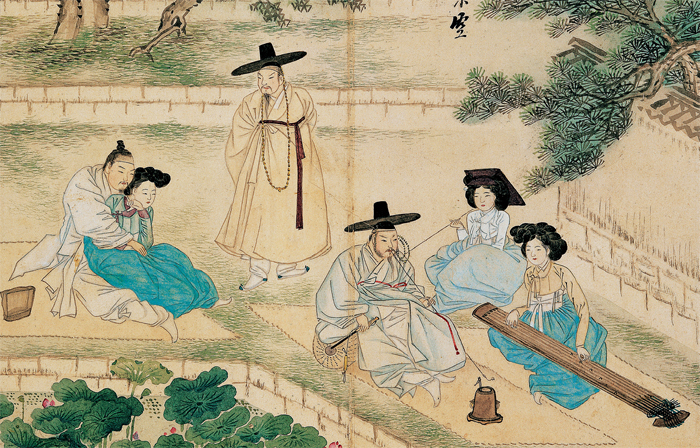
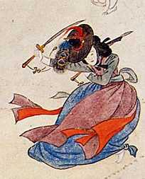

> Originally written as a history research paper for the course HIST 2751H - The Rise and Fall of Ancient and Imperial East Asia at Trent University. 

The Joseon period in Korean history is a fascinating and engaging dynasty, for their political and social culture, but especially for their rich heritage and customs in the court life. The court life of Joseon period was enjoyed by the elitist members of the society, where the yangbang upper class and royal relatives resided. The palace court was the centre of Joseon’s political, social, and cultural identity. In Joseon Korea, women in high positions in court thrived in performance art and poetry, and advocated ideals of good governance that contributed to the unique court culture. Although they were often disregarded or forgotten within the highly stratified society, their influence was no doubt great and powerful, where their contribution to the Korean art forms have made the rich cultural heritage of the Joseon Dynasty. In essence, despite the male-dominated society that was Joseon Korea, the Joseon women were the true pioneers in maintaining and developing the nation’s cultural art forms. 

The argument posed in this essay, is not a popular one. Many sources concerning the role of women during the Joseon Dynasty of Korea do not hold the view that women were influential or pivotal in the foundations of the Joseon culture. Chung –Hee Soh, a sociocultural anthropologist, argues that women were sexually segregated, where the majority of women were preoccupied with the patriarchy of the Korean system[^1].  Women were directly affected by the sexual labour system of Korea since the Joseon dynasty, where they were rather viewed as objects for male pleasure. Dr Anders Karlsson, a professor specializing in the culture of Japan and Korea, argues that women, specifically Joseon upper class women rarely had the chance to interact with other members of their society[^2].  Such views towards women of the Joseon Dynasty as confined, restricted members of the society are common. However, women throughout history of numerous nations have struggled within their sexually segregated society. This does not mean they were not able to partake in societal matters or influence the members of her family, close relatives, and associates of friends and fellow citizens. In a highly isolated setting such as the court where members of the upper class lived alongside each other, and where the importance of cultural and ritual forms of art were emphasised, women flourished through their abilities and artistic endeavours at court. This essay aims not to disprove the argument of major historians and experts that women in Joseon Korea suffered from inequality. However the influence these women were able to instil on the matters of the court where all the major political, social, and cultural matters of the country took place remains to be an argument worth observing. 

In the Joseon period women in general were viewed inferior to men, due to the Confucian ideals that dominated the country. The contributions of women were often lost in the male-dominated society[^3].  Although this hindered women from being recorded in history, it is clear from the sources that survived that they have made significant impact on the Joseon culture. Many women in Joseon period were illiterate, such as the majority of women in the common class whose lives consisted mostly confined to the domestic life[^4]. This also hindered the voices of the women to be recorded in history. The patrilineal and patriarchal society of the Joseon Dynasty also suggest that women’s role in the Joseon period were often repressed and subject to difficulty where it was unlikely for them to make significant contributions to the political or cultural areas of the court[^5]. Societies based upon the emphasis on the paternal side suggest a gender segregated society, where different gender roles were expected to be followed by the subjects of the king. It is important to note however, that it was only in the late half of the Joseon Period where the partilineal system was institutionalized, where the deepening devotion to the Confucian ideologies by the educated aristocrat class were emphasized and enforced[^6].  Therefore, in the changing political and social society of Joseon period, with the deepening importance of Confucian ideals, the role of women was minimal. In a male-dominated society such as the Joseon Dynasty, it would seem almost impossible that women were influential enough to be able to affect the art forms that are central to the Joseon culture. However the court life provided the women the opportunity to influence the political and social matters of the country. They also maintained the various art forms that were almost confined to the female gender to create the rich cultural heritage of Joseon Korea.  

The women of the common class were restricted in the society of the Joseon Korea, but women who lived in courts and were politically affiliated through their aristocrat or yangbang husbands or relatives had the opportunity to influence important members of the court. These women in court adapted to the delicate elitist society of court life and became powerful figures in the social sphere of Joseon government. Particularly, women flourished in art in Joseon Korea[^7]. As performers they dominated the court with their presence. The Joseon period in Korean history is unique for their creation and implementation of Uigwa; a list of royal protocols and rituals that were to be performed before any number of important events such as the coronation of a king, or a wedding[^8]. The Uigwa can represent how important Joseon people treated the rituals or court performances in the court lifestyle. These mandatory performances or rituals were recorded to have been performed by many artisans and courtesans of the court[^9]. Many of the female artisans and courtesans were important aspects of the Uigwa who needed such dancers, musicians, and performers to declare a royal event. Women played part in Uigwa by both playing instruments and dancing on the court stage in many cultural court dances. Through their participation in the Uigwa women in the court had a voice over how a certain Uigwa or rituals were to be performed. The women and their talents in the court were acknowledged through the Uigwa, which were integral part of the court life in the elitist society.
 
 

Shin Yun-Bok, Resounding Geomungo Prasieworthy Lotus, painting http://www.cbc.ca/ideas/episodes/features/2011/04/05/speaking-flowers/

The Gisaeng girls of the Joseon period exemplify the influence even a common class woman could gain at court, with the abilities of her talents. The Gisaeng girls of ancient Korea were entertainers, mostly girls from the lowest common class who were brought into the court at a young age to be educated the court life and art forms. At court, they were treated as the lowly entertainers for the court men[^10]. However the Gisaeng girls were especially trained in etiquette, writing, drawing, as well as the dances and instruments that they master for all their lives. By law, daughters of a Gisaeng were forced to be Gisaengs themselves, and were relieved from Confucian ideals of chastity[^11]. With the proximity to the important men in high yangbang society at court, the Gisaeng girls established close relationships with important men. Marriages were common, where their status were elevated to the yangbang lady class if they were able to become wives or concubines of the yangbang[^12].  Such relationships that Gisaeng girls were able to establish illustrates how women gained power at court. The Gisaeng girls also symbolized the artistic talents of a court. Within the three classes of the Gisaeng girls, there were private court artisans who held exceptional skills in literature, dance, and music[^13].  These women held powerful place at court and enjoyed wealth and connections that they were able to grasp from kings and high officials. In many cases these master Gisaeng ladies, when they became too old to perform, made a life of bringing in young girls to teach them the skills and talents of being a Gisaeng[^14]. These women taught what they have mastered their entire lives to the new generation of girls the ways of a Gisaeng, which produced superior poets, dancers, musicians, and theatrical performers that was specific and exclusive to women at court. 

Gisaeng girls were also important to foreign ties Joseon Korea had with other countries. Politically important visitors to a court were entertained by a Uigwa performance or Gisaeng entertainer[^15]. These visits with members from China or other politically important neighbouring nations were very important for the nation of Korea. How these visitors enjoyed their stay at the Korean palace affected their political ties to the country. Despite the fact that many Gisaeng girls were by birth from the common class in the Joseon society, they endured the harsh lifestyles of the court to associate with the elitist class, and as masters of various art forms they established themselves to be indispensable assets to the court. 

The women of Joseon Korea were also pioneers in Korean poetry. With the invention of the Korean alphabet, women were both favoured and encouraged to write poetry[^16]. Korea has borrowed the Chinese writing system for centuries, but with the invention of Han-gul a Korean identity was born, specifically with the Korean poetry style that flourished by the women in the Joseon period[^17]. While most of the male yangbang upper class chose to continue write and communicate through the Chinese writing system, the new Korean alphabet system were adopted by the women in court. Because of the dominant role women have played with the new Korean alphabet, some writers that overviewed the Joseon period even state: “..it is not too much to say that Korean national literature in its true sense was preserved and developed by women.”[^18]  Although much academic writing from the Joseon period concerning the subjects of art and poetry were done by men, in reality the actual masters of ancient Korean poetry that used the Hanguel system were women. 

The women of Joseon Korea also increasingly began enjoying literature in the Joseon period. The increasing number of women who immersed themselves with literature is evident, as is the case of a Joseon writer Kim Man-jung who wrote the fiction Kuunmong for his mother[^19]. The anonymity of the mother of Kim Man-jung illustrates how women are often forgotten in the male dominated society of Korea, despite their influence as intellectual educators that continued the succession of the next generation. In late Choson period, as readership of Korean literature became popular with women, it became common for male writers to condemning the women who read fables[^20]. This is also another example of how women were suppressed in the male-dominated society, despite their obvious influence to society.

The Korean dances are rich art forms that vary as much in the emotions it displays as well as the instruments that accompany the dancer. The dances themselves signify the greater culture of the Joseon people. The court dances that were especially well recorded due to the Uigwa practices illustrate the emphasis of women in the performances. An example is the Boating Dance was a court dance that was specifically choreographed to be performed by female dancers, and it consisted of almost 40 members who wore military naval customs and depicted the rowing and anchoring of the boat with musical accompaniment[^21]. The Joseon customs called for outer and inner banquets, where outer banquets were performed specifically for kings and male officials and inner banquets were performed for the queens and ladies of high court positions. An example of how women in court were influential enough to change court traditions is the prohibition that banned the Gisaeng girls to be perform in the outer banquets for men. The wives and women of the men in court did not like the idea that girls were dancing in front of the men, so they created a prohibition where Gisaeng were no longer allowed to perform on the outer banquets[^22]. Although the prohibition did not last long, it demonstrates the enough power queens and mothers of court had to change the traditions of the court, simply based on their dislike for the Gisaeng class girls at court. 

Unknown, A 19th-century Korean painting depicting a kisaeng performing a sword dance.

Joseon Korea, similar to many other societies in East Asia of those times was a male-dominated and heavily Confucian influence society. Women, therefore, are often subjective to being disregarded when looking at Korean history. However, women in the Joseon Korea were essential in shaping the country’s cultural heritage, especially in the court settings of a palace where most of the political, social, and cultural matters took place. Women in these court settings were able to wisely govern their place at court in accordance with the powerful male yangbang and royal class at court. Women’s presence at court, whether they were Giseang, poets, or educated wives and daughters of the elite men, maintained the Joseon’s cultural heritage. Through mastering dance, literature and poetry, performance, music and instruments, and other art forms available communally or specifically to women, the Joseon women were integral in shaping the Joseon Korean identity. 

[^1]:
  Chung Hee Soh. “Women’s Sexual Labor and State in Korean History.” Journal of Women’s History 15, no.4 (2004): 171.

[^2]:
  Anders Karlsson, “Famine Relief, Social Order, and State Performance in Late Choson Korea.” Journal of Korean Studies 12, no.1 (2007):121.

[^3]:
  Jungwon, Kim, “Finding Korean Women’s Voices in Legal Archives.” Journal of Women’s History 22, no. 2 (2010):149.

[^4]:
  Ibid., 149.

[^5]:
  Clark W. Sorensen, “The Myth of Princess Pari and the Self Image of Korean Women.” Anthropos 83, no.4 (1988): 404.

[^6]:
  Ji- Young Jung, “Widow’s Position and Agency in the Late Choson Dynasty.” Journal of Korean Studies 14, no.1 (2009): 63.

[^7]:
  David McCann, “Traditional World of Kisaeng.” Korea Journal 14, no.2 (1974): 40.

[^8]:
  Chan Seung Park, “unearthing Joseon Court Life from Uigwe, Joseon’s Documentary Heritage.” Korea Journal 48, no.2 (2008): 5-6.

[^9]:
  Byung Ju Shin, “Court Life and the Compilation of Uigwe During the Late Joseon.” Korea Journal 48, no.2 (2008): 38.

[^10]:
  McCann, “Traditional World of Kisaeng,”40.

[^11]:
  Sung-Won Cho, “Renaissance Nun vs. Korean Gisaeng : Chastity and Female Celibacy in “Measure for Measure” and “Chun-Hyang Jeon.” Comparative Literature Studies 41, no. 4 (2004): 574.

[^12]:
  Ibid, 575.

[^13]:
  Chung Hee Soh. “Women’s Sexual Labor and State in Korean History.” Journal of Women’s History 15, no.4 (2004): 172.

[^14]:
  Ibid, 172.

[^15]:
  David M. Robinson. “Disturbing Images: Rebellion, Usurpation, and Rulership in Early Sixteenth-Century East Asia- Korean Writings on Emperor Wuzong.” Journal of Korean Studies 9, no.1 (2004): 99.

[^16]:
  Dong-Uk Kim. “Women’s Literary Achievements.” Korea Journal 3, no. 11 (1963):33.

[^17]:
  Patricia Ebrey and James Palais and Anne Walthall, East Asia: a Cultural, Social, and Political History (Belmont: Wadsworth, 2009), 153.

[^18]:
  Kim, “Women’s Literary Achievements,” 33.

[^19]:
  Michael Kim, “Literary Production, Circulating Libraries, and Private Publishing: the Popular Reception of Vernacular Fiction Texts in the Late Choson Dyansty.” Journal of Korean Studies 9, no.1 (2004):4.

[^20]:
  Ibid, 5.

[^21]:
  Jeong-Hye Park, “The Court Music and Dance in the Royal Banquet Paintings of the Choson Dynasty.” Korea Journal 37, no. 3 (1997):130.

[^22]:
  Ibid 126.
