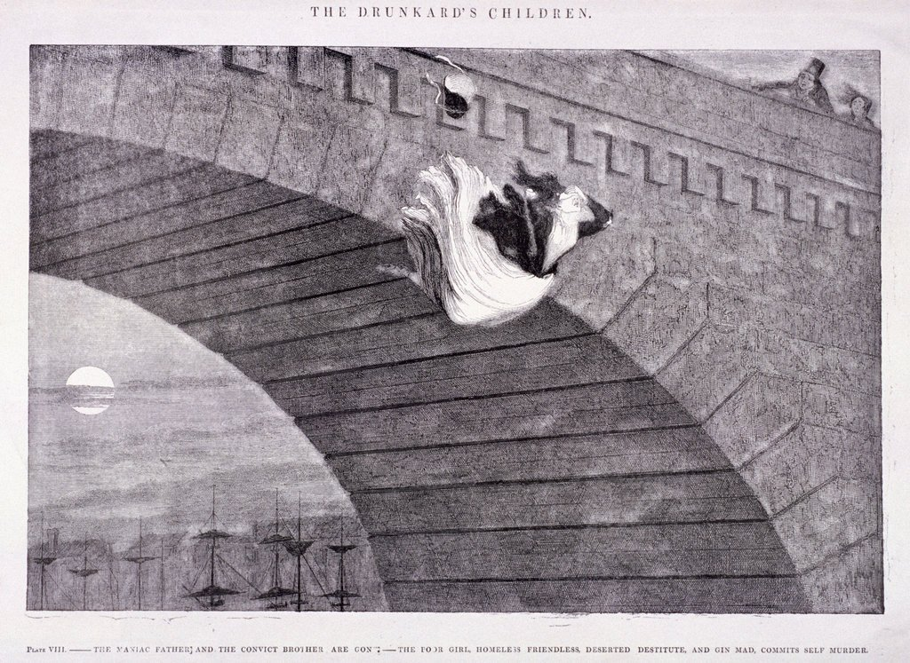
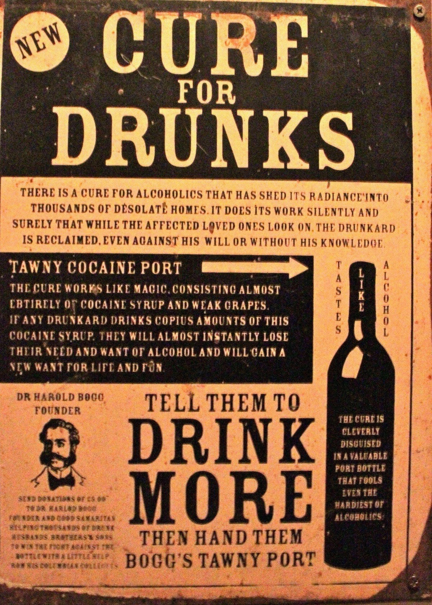
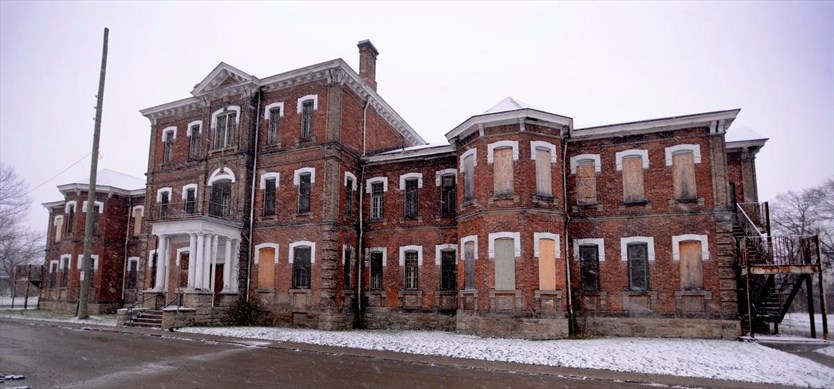
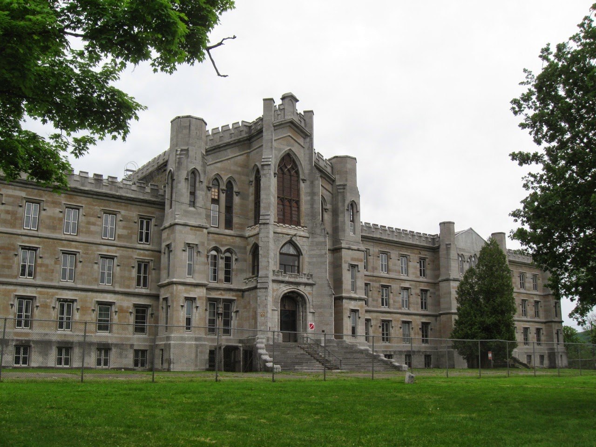

> Originally written as a research essay for the course HIST 4800Y - A History of Madness at Trent University.

The history of alcoholism treatment in the asylum is at times a neglected part of history. Often overshadowed by the greater psychiatric movement that swept across North American asylums between 19th-20th century, the experiences of alcoholic patients in the asylum is often kept hidden in historical discussions. This essay intends to draw parallels in the treatments towards those who were deemed to be alcohol-dependent, and those who were deemed to be mad. Alcoholics have always been marginalized and scrutinized under religious context throughout history. In 19th century when the consumption of alcohol was rising in communities around the world, alcoholics were institutionalized in an effort to contain the disease from spreading. Within asylum walls, alcoholic patients and other mentally ill patients alike suffered from rudimentary treatments and procedures that aimed to “cure” the illnesses but often harmed the patients. By 20th century, in a desperate attempt to control the disease of addiction, many psychiatrists and medical professionals sought to extinguish the individuals suffering from mental illnesses through eugenic movements. Deinstitutionalization aided in criminalizing alcoholics who were released from asylums with no access to treatments that could aid their recovery. When alcoholism and other mental illnesses proved to be resilient to cure, those deemed drunk or mad were criminalized under laws that sterilized them and took away their human rights. The consequences of this history are the resounding negative attitudes towards alcoholics and mentally ill that can still be found today. Throughout North American history, those suffering from alcoholism suffered maltreatment both within and outside asylum walls by societal forces that sought to marginalize, medicalize, and criminalize them. This history reflects the lack of protection alcoholics and other mentally ill patients experienced, and the suffering that they had to endure.

Throughout history, alcohol consumption was scrutinized as immoral behaviour. Abstinence from alcohol is encouraged in the bible[^1]. In 19th century North America, the temperance movement emerged alongside other sociopolitical movements such as teetotalism, abolitionism, and health reforms[^2]. As a societal movement that sought to regulate and eliminate the act of drinking, the temperance movement preached alcoholism to be a sinful behaviour. The belief that alcohol consumption was sinful was perpetuated with the notion of original sin. Original sin is the notion that mankind is susceptible to evil behaviours, such as drinking[^3]. In 1808, reverend Jonathan Edwards published a book titled The Great Christian Doctrine of Original Sin Defended in the city of New Jersey. As an academic text intended to prove the existence of original sin and therefore a susceptibility of mankind to engage in evil activities, drinking was outlined to be “greedy” and “wicked”[^4]. He would later go on to state that the reason why mankind is easily persuaded to drink is because men are born from women, who herself is morally flawed[^5]. These attitudes to denote humankind to be morally weak based on heredity, and attributing women as the causes of mankind’s susceptibility to drink, illustrate that religious beliefs directly affected the perception of alcoholics. Alcohol, along with alcoholics, were scrutinized to be abnormal substances in society. 

The rise of the temperance movement in 19th century coincided with a rise in alcohol consumption in communities around the world. Alcohol was being produced and consumed rapidly, from the loud and noisy taverns in Paris[^6], to the cobbled streets of London[^7],  to the Italian bistros[^8],  to post-Napoleon war Russia[^9].  In 1881 Ontario, for example, a total of 3795 men and women were arrested for “drunk and disorderly commitments”, where women made up 19% of the total[^10]. The rise in alcohol consumption correlated with a rise for concern for violence and deterioration of population. Alcohol was becoming a major concern for the public leaders. Political leaders viewed the rising number of alcohol-related arrests to be a direct reflection of society’s corruption. This concern is reflected in a statement from John Ordronaux, who was a respected American Civil War surgeon, and State Commissioner in Lunacy for New York in 1874.  He stated in an article of The American Journal of Insanity: “Whatever diversity of views may be entertained touching the nature of drunkenness, all are agreed in regarding it as a self-inflicted wrong to the person, eventuating in a wrong to society.”[^11] Alcoholism, in this way, was interpreted to be a major threat to the wellbeing of society. The states saw the need to directly engage with the issue of rising alcohol consumption in North America. Similarly at this time, the number of insane patients requiring institutionalized guardianship increased in America[^12].  

A painting by George Cruikshank. 1842.

  

Under the religious and political scrutiny, alcoholism in the 19th century North America was not seen as a legitimate disease. Many leaders denied the possibility that alcoholism could be defined by medical terms, and rather viewed it as an expression of depraved behaviour[^14]. As historian Cheryl L. Krasnick explained, “Emphasis on hereditary, congenital and psychological factors was opposed both by pious temperance reformers who believed that individual sin and moral degeneracy were responsible for drunkenness.”[^15] The notion that alcoholism could not be defined as mental illness was harmful for individuals who suffered from the illness with no options for treatment. At this time, the only treatment available for an alcoholic was to abstain from drinking[^16]. For the individuals suffering from the disease of addiction, they required a professional shift in the opinions from the medical world who could testify that alcoholism was a legitimate illness in order to be treated for their illnesses. 

Some works that were instrumental in redefining alcoholism, was Benjamin Rush’s essay An Inquiry into the Effects of Ardent Spirits Upon the Human Body and Mind. This was the first documentation published in America that regarded alcoholism to be a disease[^17]. T.D Crothers’s numerous articles for the publication of The Journal of Inebriety, was also instrumental in introducing the subject of alcoholism in a medical context[^18]. The Journal of Inebriety, also known as The Quarterly Journal of Inebriety, was the first journal published in America concerning alcoholism between 1876-1914, under the leadership of Dr. Joseph Parrish and Dr. Willard Parker[^19]. A.M Roseburgh’s The Treatment of Inebriates represented a Canadian authority on advocating alcoholism as a legitimate disease[^20]. Other authors included Isaac Ray[^21]. All these journals were pivotal essays that introduced the notion that alcoholism could be treated as any other mental illnesses in asylums.  Together, these essays and medical journals represented a prominent voice in United States and Canada that advocated for alcoholism to be recognized as a mental illness.

Although alcoholism was still challenged by some reformative thinkers to simply be an immoral behaviour, many key professionals and their important works in the medical field supported the idea that alcoholism was a disease in 19th century. Samuel B. Woodward was the first superintendent of the Worcester State Hospital in 1833, who wrote about the inebriates in the following statement:

> “Like insanity, intemperance is too much of a physical disease to be cured by moral means only. The appetite is wholly physical, depending on a condition of the stomach and nervous system, which transcends all ordinary motives of abstinence. The suffering is immense, and the desire of immediate relief so entirely incontrollable, that it is quite questionable whether the moral power of many of its victims is sufficient to withstand its imperative demands.”[^22]

Attributing the craving for alcohol to be “incontrollable” was a powerful statement that took away the moral responsibility of alcoholics who had a difficult time quitting alcohol consumption. Such notions towards accepting alcoholism as a diseases aided in understanding that an alcoholic did not have the physical capabilities to stop drinking. Other superintendents agreed with Woodward’s stance on alcoholism, such as Edwards Ryan, a superintendent of Medicine at Rockwood Asylum in early 20th century. He stated: “The alcoholic, the drug inebriate, the toxic following fever, all must be certified as insane before receiving treatment.”[^23] This parallel view towards alcoholism and insanity illustrate that both diseases were seen be similar, where the illnesses were seen to be possible to be “cured”. At this time, the explosive interest for alcoholics and other mental illnesses to be cured was increasing[^24].

Inebriate reformers at the turn of the 19th century were separated into two schools of thought. One side viewed alcoholism as a hereditary disease fully capable of being medically treated, while the other side viewed alcoholism as an untreatable disease born out of “ignorance and the social environment”.[^25] The rise in public drinking among communities produced anxiety in both the state and the people, where many were fearful of becoming “slaves to the drink.”[^26] While those who viewed alcoholism as untreatable behaviour encouraged abstinence as the only means to treat the addiction, others sought to have alcoholism be recognized as a legitimate illness. Soon, alcoholism in North America began the transition from a deviant behaviour to a legitimate disease in 19th century[^27]. The transition of alcoholism into a disease was important for the future, because it allowed alcohol to be medically treated by professionals as a legitimate illness for the first time. 

An interesting way in which alcoholism began to be seen as mental illness is demonstrated by the German word “trunkferfet”. Coined by a German Dr. Bruhl-Cramer in 1819, the word became translated in English as “dipsomania”.[^28] This was an important moment in the history of alcoholism, because for the first time in history, the state of drunkenness could be discussed purely through a medical term, without association to the person’s moral state. Unlike words like “drunkard” or “inebriate”, “dipsomania” was new term that could be discuss alcoholism as a medical illness. Dipsomania represented an effort from the medical professionals who saw alcoholism as an illness, who subsequently created a new vocabulary to treat illness without stereotypes.

With alcoholism now becoming a legitimate disease like other mental illnesses, alcoholics could be treated within the asylum. However, the access to asylum doors and subsequent institutionalization was just another method of confining the individuals who were seen to be unfit for society. Although alcoholism was now seen as a disease, drunkards continued to be marginalized and removed from society. And the treatments that awaited them inside the four walls of the asylum were not always too pleasant. 

Asylums that treated alcoholism often ended up accepting patients suffering from other illnesses as well. In the book Social Class and the Treatment of Alcoholism, authors Schmidt explains: “Throughout the nineteenth century attempts were made to propagate the conception of inebriety as a disease, and there was, in fact, a small number of institutions in which alcoholics were treated as ill persons. But by the late nineteenth century most of the centres were closed or taken over for the treatment of the mental disease.[^29] One of such reformative centers aimed at alcoholic patients was the New York State Inebriate Asylum.  As the first institution to treat alcoholism in America, it opened its doors in 1858, and only accepted male patients[^30]. The asylum closely followed the moral therapy guideline when treating patients psychiatrically. The New York State Inebriate Asylum had three superintendents that applied moral treatment to the patients differently.  Dr. Turner emphasized segregation, structure, and relied heavily on order. Dr. Parker focused on an industrial approach and activities for moral therapy, while Dr. Day heavily relied on humanization and drug therapy[^31]. The varying approaches to moral therapy applied to patients in the asylum illustrate that medical professions were not unified in their curative treatment for alcoholism as a disease. Historians Crowley and White also argue that by the end of the 19th century, moral therapy was practically non-existent, where it disappeared due to the harsh realities of asylum management[^32]. Other historians also agreed that moral therapy was a doomed therapy, because the sheer number of mentally ill patients throughout the 19the century overwhelmed the possibility for such time-consuming treatments[^33]. New York State Inebriate Asylum faced further criticism from the surrounding neighbourhoods that questioned the legitimacy in the claim that the asylum could cure alcoholism, and also whether alcoholism was a disease worth treating[^34]. The difficulties the asylum faced from the public shows that judgement of alcoholics still continued, despite the fact that alcoholism recognized as a mental illness by medical professionals. 

Similarly in Canada, inebriate asylums often accepted patients suffering from other illnesses, such as insane patients. The Hamilton Asylum was meant to be the first Canadian asylum to treat alcoholism, yet by the end of construction the building was converted into an insane asylum[^35]. 

A more successful case of an inebriate asylum in Canada is the Homewood Retreat in Ontario. Homewood Retreat accepted female patients, but during the first years it solely relied on private male patients to keep the asylum running financially[^36]. Although the asylum was relative successful as a curative center for recovering alcoholics between 1883-1920, nonetheless it faced difficulties due to the conflicting professional opinions on the treatment for alcoholics[^37]. Scattered opinions in the medical profession meant alcoholism as a disease was not yet perfectly understood, which resulted in the patients receiving inconsistent medical treatment. 

These asylums and the difficulties they faced in treating alcoholics represent the resistance they faced both externally and internally. The external struggles they faced from the public that still questioned the legitimacy of alcoholism affected the asylum’s ability to thrive as an institution. The internal struggles the asylum faced from physicians with differing views towards the understanding of the disease, resulted in a lack of centralized treatment[^38]. One former patient, named “Agnes” sued the institution in 1888 for horrible living conditions, bad food, violence from attendants, and “entire disregard of them and the surroundings of the patient”.[^39]  These malpractices within inebriate asylums illustrate that treating alcoholics as an institution was no simple task. Alcoholism as a disease continued to face prejudices from society, and doctors and professionals who provided treatment, often became malpractice towards the patients in the asylums.

Asylums represent a unique history into the marginalized individuals in communities. Therefore, it is important to examine them in order to gain a better understanding of the kinds of treatments that were administered to individuals suffering from alcoholism. As historian Thomas E. Brown wrote, "...ultimately, the asylum should be studied not in and for itself but for what it reveals about the nature and meaning of the wider nineteen-century social order."[^40] This is true when looking at what alcoholics faced when they sought for treatments for their addiction. They were seeking relief from their addiction, instead oftentimes suffered. They were physically and mentally harmed by the psychiatric profession, when they experimented their theories for a medical cure for addiction. In the 20th century, when the number alcoholic and mentally ill patients increased, society began directly attacking insanity and alcoholism through the patient’s body.

The medical treatment towards alcoholics included various treatments that ranged from mental to physical treatments that were often harmful to the patients. Aversion therapy was a psychological treatment, considered to be one of the earliest methods in behaviour treatment for alcoholism[^41]. It was a treatment where alcohol was presented to the patient alongside negative associations that induced anxiety within the patients. Historian Peter M. Million mentions, that although the treatment was considered successful, it was rather the patient’s choice to invoke the memories of pain associated with aversion therapy that made them avoid alcohol in the future[^42]. A typical experience of aversion therapy was not pleasant, and produced violent reaction in patients, such as vomiting[^43]. A typical aversion therapy in the 1960’s included: “… after a person has repeated experienced strong nausea in conjunction with alcoholic beverages the mere sight or smell leads him to revivify his past nauseous experiences. In this conceptualization aversive reactions are, in large part, self-induced rather than automatically evoked. If the aversive self-stimulation established through counterconditioning is potent enough, a person may be able to counteract the disposition to engage in deviant behavior by symbolically reinstating nauseous reactions whenever the need arises.”[^44]  Such treatment in behaviour modification shows the attempt to condition the cravings for alcohol into a violent reaction to avoid drinking. Aversion therapy induced unpleasant and uncomfortable states in patients who had to endure a substantial amount of pain in order to overcome their addiction.

A popular treatment for alcoholics included substance or drug therapies. Addictive substances were used to “ween off” patients from alcohol, through administering substances such as “tonics, bromides, and cannabis indica”.[^45] Some treatment for the insane and alcoholic alike included administration of “tartrate of antinomy, calomel, opium, sulphuric ether, and other opiates”[^46] Such drug therapies oftentimes worked to induce further addiction in patients. In some instances, chemical agents considered to be poison was administered to patients to “cure” their alcoholism. Known as the “gold cure”, a concoction which included a “gold-colored serum composed of atropine and strychnine” were administered to patients that proved to induce negative health effects in the patient’s internal organs[^47]. Some claimed major success rates with drug therapies involving other addictive substances such as opium and cocaine, due to the fact that these substances were more addictive than alcohol. Patients gained new addictions from the drug therapies administered, which unfortunately did not succeed in the patient to overcome their addictions.

LSD was also used in treating alcoholism by doctors in the 1950’s. In Psychedelic Psychiatry by Erika Dyck, it is stated that “Dr. Hoffer and Osmond initially tested LSD in relation to alcoholism with the underlying belief that it would chemically alter the patient’s metabolic makeup and cure a neurological process that, they believed, caused alcohol addiction.”[^48]  This initial theory on the effects of LSD on alcoholism later evolved, where doctors administrated large doses of LSD to patients by inducing a state of “delirium tremens”.[^49] In a patient interview conducted by the author, the patient recalls the experience: “I had a very definite spiritual experience. It is with me to this day and has changed my attitude to a number of things… It changed… my sense of the world and my place in it.”[^50] Such experiences induced by the patients demonstrate that the effects of the drugs administered for a radial response from the patients. The former patient, who wished to stay anonymous, relapsed soon after the LSD treatment[^51]. The LSD treatment was not effective in curing alcoholism, but rather an experimental method devised by doctors who wished to test out their theories on alcoholic patients.

Vintage ad for Tawny Cocaine Port, 19th century 

In other interesting instances, alcohol was also used as medicine. Many doctors believed that alcohol was an effective therapeutic agent for all kinds of illnesses of the body[^53]. Alcohol being administered as medicine increased the complication in alcohol’s role in the human body. In 1897, for example, a British doctor William Yeats attempted to cure breast cancer by directly injecting alcohol into a tumor of a 20 year-old woman[^54]. They believed that alcohol had special properties that could destroy cancer cells. Some doctors believed that insanity was caused by alcohol, and vice versa[^55]. In other instances, doctors themselves were getting drunk from using alcohol that was meant to be used as anesthesia in surgeries, where the doctors even became addicted to the anaesthetics[^56]. These bizarre behaviours by doctors demonstrate the fascination for alcohol in the medical world at this time. In the 1860’s, physicians “brandied” patients who were suffering from conditions like pneumonia, typhus, and rheumatic fever, where in some cases they were administered more than three pints of brandy a day for multiple months[^57]. These therapies in 19th-20th century illustrate the complexity of alcohol’s role in the medical field, where physicians held opposing beliefs about the alcohol and it’s healing properities for illnesses while simultaneously recognizing alcohol could cause addiction.  

Other treatments towards alcoholics included many different forms of permanent and damaging procedures. Historian William White wrote various essays condemning the medical procedures during the early 20th century that produced iatrogenic results in patients. He writes: “The 1940s and 1950s witnessed addiction treatments that included the use of electroconvulsive and insulin shock therapies as an aid to addict withdrawal and the experimental use of psychosurgery (the prefrontal 12 lobotomy) as a treatment for alcoholism and narcotic addiction.”[^58] The infamous Dr. Walter Freeman and Dr. James Watt were physicians who were responsible for popularizing psychosurgery, or lobotomy[^59]. Their 15th lobotomy patient conducted in America was an alcoholic who they hoped would cure of him of his “pathological craving for alcohol”.[^60] This obviously turned out to be a failure, when the patient went right back to drinking afterwards[^61]. Similarly in a 1948 case in Buffalo, a 42 year old man, addicted to morphine due to severe pain from a back injury, sought and received lobotomy as treatment for his addiction to morphine[^62]. He was described to be cured, but not without the grave outcome of losing his ability to verbalize his pain or emotions[^63]. Lobotomies represent a drastic procedure to eradicate the source of mental illness by physical mutilation of the human brain. Between 1949-1953, over 20,000 Americans received lobotomy as treatment for their mental illness and alcoholism[^64]. Permanently damaging, these procedures often left the patient unable to verbalize or move, ultimately disfiguring the individual’s bodily capabilities. These treatments illustrate the severe medical treatment patients in asylums underwent due to their label as being mentally ill.

As these medical “cures” suggest, alcoholic patients suffered from horrendous maltreatment from so called professional who used their patients as subjects to try out their theories on treatment. In this sense, asylum patients in 20th century were more guinea pigs than patients with rights to his or her body. The medical maltreatments such as lobotomy, electroconvulsive and insulin shock therapies[^65], administered to patients show that it was highly likely the physicians disregarded what kind of pains the patient might experience, and were self-motivated in their search to fix illnesses as medical professionals. Ego likely played a factor in their search for these “cures”, where physicians and psychiatrists were trying to satisfy an excited audience who were hopeful for an answer. In short, the 20th century medical treatments for alcoholism was an effort highly motivated by the need to find and destroy the cause of alcoholism in the human body. In a way, hysicians, the public, and the patients alike were overwhelmed with a fetishizing of the wonder cure, the one cure to fix all ills in the human body. It is important to remember the patients behind these medical efforts, and the suffering they have encountered, and endured long after the procedure. Through the medical treatment available in psychiatry throughout the 20th century, the mentally ill and alcoholic patients experienced pain, bodily harm, and in some extreme cases, lost their mental and physical capabilities to function. Their freedom was taken way within the asylum walls, and they suffered horrendously. 

At this point in the discussion, it is important to mention the lack of patient accounts when discussing the medical treatment for alcoholics. It has been proven difficult to find first-hand patient accounts who have experienced and survived from these procedures. Some physicians accounted the absence of reliable data on the lack of knowledge on the experiences of the patients[^66]. In the future, a specific focus on survivors of maltreatments in 19th-20th century North America will further the research on the topic of alcoholism as a mental illness. Patient views will offer a completely different history of madness and alcoholism that could shed more light into the experiences of the alcoholic.

By the 20th century, a large shift in psychiatry led to the criminalization of alcoholics. Asylums have been not successful, and it was apparent that it was no longer the promising answer to the growing number of mentally ill populations. Outside the asylum walls, American and Canadian citizens who suffered from severe cases of alcoholism faced grim realities. They continued to face prejudices from society, with slim possibilities to reintegrate back into an asylum-less lives[^67]. Also at this time, a pivotal idea was being spread. Eugenic theories populated the medical field both in America and in Canada, where they viewed alcoholism to be hereditary. Auguste Forel was an important voice advocating the hereditary dangers of alcohol. As a prominent figure in the discussion of eugenics, the Swiss doctor stated: 

> “It is already well-known… that inebriety, the chronic poisoning by alcohol, is transferred by the degeneration of the semen of men and of the ovaries of woman to the progeny of the drunkard. It is true, it very frequently causes in the descendants of the above-mentioned irresistible longing for alcohol, but also a variety of other diseases, the children of drunkards perishing in large percentage of debility of life, dwarfed growth, idiocy, mental diseases, and so forth.”[^68]

Historian Elizabeth Armstrong explains that Forel believed that germ cells (sperm and egg cells) from humans were poisoned when they come in contact with alcohol, which affects the offspring of alcohol drinkers in a negative way[69]. The notion that an alcoholic produced alcoholic children, was a dangerous idea that made individuals suffering from addiction susceptible to ideas of sterilization. The desire to control these “unfit” individuals from procreating was so great, that in some cases, facts were manipulated to propel this idea that alcoholics did not deserve to live. Family lineages were closely studied in order to produce evidence that the descendants of this family were unfit members of society. An example of this is the family named Jukes, which was used as an example by Richard Dugdale in his book The Jukes": A Study in Crime, Pauperism, Disease and Heredity; Also Further Studies of Criminals in 1877[^70]. Historian Elizabeth Armstrong summarizes the results of the book: 

> “Frau Ada Jurke, who was born in 1740, and was a drunkard, a thief, and a tramp for the last forty years of her life, which ended in 1800. Her descendants numbered 834, of whom 709 were traced in local records from youth to death: 106 of the 709 were born out of wedlock; there were 144 beggars, and 62 more who lived from charity. Of the women, 181 led disreputable lives. There were in the family 76 convicts, seven of who were sentenced for murder.”[^71] 

Richard Dugdale’s in-depth study of a family lineage produced results that one mentally ill and deviant character, produces hundreds of “unfit” children. The argument of this research was that criminality should be controlled by sterilizing members of society who were burdens to society. Other researchers in early 20th also agreed that individuals with alcoholism produces inadequate children. As C.W Saeeby wrote, “Inebriety, the chronic poisoning by alcohol, causes not only irresistible longing for alcohol, but also a variety of other diseases… The children of drunkards perishing in large percentage of debility of life, dwarfed growth, idiocy, mental diseases, and so forth." [^72] Saeeby was a physician who represented a prominent authority on the eugenics movement. He wished to euthanize alcoholics in order to produce a bloodline without the mental illness spreading to the offspring[^73]. Such notions placed alcoholics, and other mentally ill patients at risk of being targets of organized sterilizations. If societal forces such as the prohibition movement in the 20th century[^74] sought to criminalize alcohol in an effort to eliminate alcohol from society, the sterilization acts[^75] and eugenic movements sought to criminalize the alcoholics and other individuals deemed to be “mentally unfit”, in an attempt to eliminate them from society.

The similarities of how alcoholism was treated and how those deemed mentally ill were treated show the tendency of societies to marginalized the vulnerable members of society. The stigma for drunken behaviours, medicalization of alcoholism, and the fear that alcoholics might procreate more alcoholics in society all contributed to the criminalization of alcoholics and the mentally ill. The medical procedures that lobotomized, sterilized, and criminalize the mentally ill illustrate the society’s approach to fix a problem by simply destroying the cause of the problem. Mental illness, alcoholism included, is still very hard to diagnosis today, which further illustrate the unfortunate circumstances of those who are deem mad or drunk in today’s society. The patients who suffered in the hands of asylums, and the greater society often had no voice in the history of alcoholism. It is important to realize who fell victim to the society that treated the mentally ill and their diseases. 

Alcoholics were criminalized in another way with deinstitutionalization. When alcoholic patients from asylums were reintegrated back into society, the social consequences were the sheer increase in numbers of inmates in jails. The Penrose theory, as discussed by historian Chaimowitz, is the phenomenon where as the number of inmates in asylums decreases, the number of inmates in jails increases[^76]. When asylums failed in treating alcoholism successfully, the patients continuing to suffer from these illnesses contributed directly to the number of homeless in society[^77]. In this way, alcoholics, as well as insane patients, became criminalized within a social system that could not treat them, or take care of them. By way of osmosis, alcoholics became criminalized when they migrated from asylum to jails. The governments in American and Canada that once took responsibility to house and treat these individuals in asylums, failed to continue to treat for their illnesses. Over numbered, and unable to manage their own illnesses due to the lack of programs and successful therapies, many asylum patients who were mentally ill were incarcerated. The real victims of the asylums and deinstitutionalization, are the patients who could not find support or recovery and subsequently continue to suffer today.

Finally, the failure of the asylums to cure mental illness is most apparent when examining the current state of asylums today. Once in operation throughout the 19th-20th centuries, many asylums are no longer treating patients, and their buildings stand empty as artefacts to the history of madness. The Hamilton Asylum, originally meant to be the first asylum in Canada intended for alcoholics, now stands empty[^78]. CBC News reported that in 2015, the asylum was under construction to become student housing for the Mohawk College.

Hamilton Asylum, 2015

 

In similar fashion, America’s first asylum for alcoholics the New York State Inebriate Asylum is now a property of Binghamton University. 

New York State Inebriate Asylum, 2015. 

As these monumental buildings became nonoperational, its patients left these buildings and became minority from the greater society. Without protection from the government, those deemed alcoholic suffered from social stigma that viewed these individuals as unfit. The scattered diagnosis and understanding of alcoholism as a disease in them medical world also contributed in their maltreatment[^81]. The mentally ill naturally became criminalized in a social system that could not provide proper treatment and recovery programs. 

The investigation into the complex history of alcoholism and insanity illustrates the importance of how the marginalized were treated in society. Highlighting the issues of religious stigma, rudimentary medical procedures, and the social consequences of alcoholic patients can hopefully further contribute to the knowledge and understanding of these illnesses today.

In the history of madness, the alcoholics are often ignored despite that they were institutionalized in the same asylum alongside the mentally insane, and subsequently experienced same treatment as insane patients. I believe there is an important historical lesson to be gained in this research that exposes social stigma on those who are substance-dependent and or mentally insane. 

The history of asylum patients suffering from alcoholism often parallels the historical treatments that mentally ill patients faced in asylum. Throughout history, alcoholism was marginalized, medicalized and criminalized by society. In 19th century, the inebriate were institutionalized in asylums in an effort to isolate and cure the moral sin of drinking. When alcoholism was recognized as a legitimate disease by medical professionals, alcoholics suffered from “curative” treatments and procedures that often resulted in pain, discomfort, and permanent mutilation of the body. In the 20th century, many asylum patients in North America became deinstitutionalized, and the patients became unwanted outlaws. Criminalized by societal forces such as the Temperance and Prohibition movements, alcohol and those who were addicted to it faced eugenic movements that sought to criminalize the substance and sterilize its users. The 19th-20th century experiences of alcoholic patients in the asylum illustrate society’s failures to protect these individuals and their health. The prejudices that alcoholics experienced in history continues today. The societal and medical treatments towards those deemed drunk or mad illustrate society’s attempt to marginalize the patients, medicalize the disease, and criminalize those suffering from the illness in a final attempt to manage the contamination of mental illness. This history of mental illness exposes society’s failure to protect those who were suffering from the disease of alcoholism and madness. ‘

[^1]:
  "He shall separate himself from wine and strong drink, and shall not drink no vinegar of wine, or vinegar of strong drink, neither shall he drink any liquor of grapes, no eat moist grapes, or dried.” The Holy Bible: New International Version (Grand Rapids: Zondervan, 1984), Numbers 6:3. 

[^2]:
  Jessica Warner, “Temperance, Alcohol, and the American Evangelical: A Reassessment,” Addiction 104 (2009): 1077.

[^3]:
  Canon Farrar, Talks on Temperance (New York: National Temperance Society and Publication House, 1881), 5. 

[^4]:
  As the President of the College in New Jersey, Reverend Jonathan Edwards defended the existence of original sin as a state of mankind, writing: “…though iniquity be the most deadly poison, yet men drink it as boldly as they drink water, are as familiar with it as their common drink, and drink it with like greediness, as he that is thirsty drinks water.” Jonathan Edwards. The Great Christian Doctrine of Original Sin Defended; Evidences of it's Truth produced, and Arguments to the Contrary Answered (Worchester: Isaac Sturtevant, 1808), 189. 

[^5]:
  “What is man, that he should be clean? And he that is born of a woman, that he should be righteous?” Jonathan Edwards. The Great Christian Doctrine of Original Sin Defended; Evidences of it's Truth produced, and Arguments to the Contrary Answered (Worchester: Isaac Sturtevant, 1808), 190.

[^6]:
  “The wine acted as a way of integrating others into a group, and of defining those who belonged and excluding those who did not. Witnesses spoke of being given a glass of wine upon joining a group of drinkers, as a formal act of inclusion.” Thomas Brennan, Public Drinking and Popular Culture in eighteenth-Century Paris (New Jersey: Princeton University Press, 1988), 224.

[^7]:
   Jessica Warner, Craze: Gin and Debaucher in an Age of Reason (New York: Four Walls Eight Windows, 2002), IX.

[^8]:
  Lolli Giorgio et al, Alcohol in Italian Culture: Food and Wine in Relation to Sobriety among Italians and Italian Americans (Illinois: The Free Press Glencoe, 1958), 91.

[^9]:
  Stephen White, Russia Goes Dry: Alcohol, State and Society (Cambridge: Cambridge University Press, 1996), 188.

[^10]:
  Cheryl Krasnick Warsh, Drink in Canada: Historical Essays (Montreal: McGill-Queen’s Press, 1993), 77.

[^11]:
  John Ordronaux, "Is Habitual Drunkenness A Disease?" American Journal of Insanity 30:3 (1874): 431.

[^12]:
  Mary A. Jimenez, “Madness in Early American History: Insanity in Massachusetts from 1700 to 1830,” Journal of Social History 20:1 (1986): 34.

[^13]:
  An illustration describing the dangers of alcohol. The caption reads: “The maniac father and the convict brother are gone – the poor girl, homeless, friendless, deserted, destitute, and gin mad, commits self murder.” Painting by George Cruikshank, taken from Timothy S. Arthur, Temperance Tales; or, Six Nights with the Washingtonians (Philadelphia: W. A. Leary & Co., 1842), https://archive.org/details/sixnightswithwa00artharch

[^14]:
  “Inebriety is not a disease but a self provoked temporary perversion of our natural functions, induced for purposes of sinful gratification.” John Ordronaux, "Is Habitual Drunkenness A Disease?" American Journal of Insanity 30:3 (1874): 432-433.

[^15]:
  Cheryl L. Krasnick, “Because There is Pain: Alcoholism, Temperance and the Victorian Physician.” Canadian Bulletin of Medical History 2:1 (1985): 19.

[^16]:
  Roy M. MacLeod, “The Edge of Hope: Social Policy and Chronic Alcoholism 1870-1900.” Journal of the History of Medicine and Allied Sciences 22:3 (1967): 222.

[^17]:
  Benjamin Rush, “An Inquiry into the Effects of Ardent Spirits Upon the Human Body and Mind: with an Account of the Means of Preventing, and of the Remedies for Curing Them,” James Loring, 1823.

[^18]:
  T.D. Crothers, “Inebriety, Its Treatment and Curability.” The Journal of Inebriety 34:2 (1912): 93-102, T.D. Crothers, “Influence of Inebriety on Public Health.” Public Health Papers and Reports 20 (1894): 348-353.

[^19]:
  Barbara Weiner and William White, “The Journal of Inebriety (1876-1914): History, Topical Analysis, and Photographic Images,” Addiction 102 (2007): 15.

[^20]:
  A. M. Rosebrugh, “The Treatment of Inebriates.” Public Health Papers and Reports 24 (1898): 291-295.

[^21]:
  Jacques M. Quen, “Isaac Ray on Drunkenness.” Bulletin of the History of Medicine 41:4 (1967): 342.

[^22]:
  Samuel B. Woodward, Essays on Asylums for Inebriates (Worchester: MA, 1838), 4.

[^23]:
  Edward Ryan, edi. “The New History Form,” The Bulletin of the Ontario Hospitals for the Insane 1:3 (1907): 11.

[^24]:
  Danielle Terbenche, “’Curative’ and ‘Custodial’: Benefits of Patient Treatment at the Asylum for the Insane, Kingston, 1878-1906,” Canadian Historical Review 86:1 (2005): 33.

[^25]:
  Roy M. MacLeod, “The Edge of Hope: Social Policy and Chronic Alcoholism 1870-1900.” Journal of the History of Medicine and Allied Sciences 22:3 (1967): 244.

[^26]:
  MacLeod, “The Edge of Hope”, 232.

[^27]:
  “It was only in the early decades of the 19th century that physicians began to consider alcoholism as a disease and were thus forced to create the necessary terminology.” William F. Bynum, “Chronic Alcoholism in the First Half of the 19th Century.” Bulletin of the History of Medicine 42:2 (1968): 161.

[^28]:
  Bynum, William F. “Chronic Alcoholism in the First Half of the 19th Century.” Bulletin of the History of Medicine 42:2 (1968): 161.

[^29]:
  Wolfgang Schmidt, and Reginald G. Smart and Marcia K. Moss, Social Class and the Treatment of Alcoholism (Toronto: University of Toronto Press, 1968), 4.

[^30]:
  John W Crowley, and William L., White. Drunkard’s Refuge: The Lessons of the New York State Inebriate Asylum (Boston: University of Massachusetts Press, 2004), 81.

[^31]:
  John W Crowley, and William L. White. Drunkard’s Refuge, 89-91.

[^32]:
  Ibid., 79-80.

[^33]:
  “However, people with all kinds of illnesses, physical as well as mental, were being put into the institutions. Syphilitics, alcoholics, and the senile elderly joined the newly insane in the hospitals, and this flood of diverse patients doomed moral treatment.” Robert Whitaker, Mad in America: Bad Science, Bad Medicine, and the Enduring Mistreatment of the Mentally Ill (New York: Perseus Publishing, 2002), 34. 

[^34]:
  John W Crowley, and William L. White. Drunkard’s Refuge, 48.

[^35]:
  Cheryl Krasnick Warsh, “Because There is Pain: Alcoholism, Temperance and the Victorian Physician,” Canadian Bulletin of Medical History. 2:1 (1985): 17.

[^36]:
  Cheryl Krasnick Warsh, Moments of Unreason: The Practice of Canadian Psychiatry and the Homewood Retreat, 1883-1923 (Montreal: McGill-Queen’s Press, 1989), 144.

[^37]:
  Cheryl Krasnick Warsh, Moments of Unreason, 144-155.

[^38]:
  Ibid., 168.

[^39]:
  Ibid., 154.

[^40]:
  Brown, Thomas E. “Dance of the Dialectic? Some Reflections (Polemic and Otherwise) on the Present State of Nineteenth-Century Asylum Studies.” Canadian Bulletin of Medical History 11 (1994): 269.

[^41]:
  Peter M. Miller, Behavioral Treatment of Alcoholism (Mississippi: Pergamon Press, 1976), 46.

[^42]:
  Miller, Behavioral Treatment of Alcoholism, 77.

[^43]:
  Jonathan Lewy, “Limited to No Responsibility: Addiction, Alcoholism and the Law in Modern Germany.” History of Psychiatry, 23:2 (2012): 170.

[^44]:
  Albert Bandura, Principles of Behavior modification (New York: Holt, Rinehart and Winston, 1969), 84.

[^45]:
  Cheryl Krasnick Warsh, Moments of Unreason: The Practice of Canadian Psychiatry and the Homewood Retreat, 1883-1923 (Montreal: McGill-Queen’s Press, 1989), 158.

[^46]:
  Joseph Melling, and Bill Forsythe. The Politics of Madness: The State, Insanity, and Society in England, 1845-1914. (New York: Routledge, 2006), 49.

[^47]:
  Krasnick, Moments of Unreason, 148.

[^48]:
  Erika Dyck, Psychedelic Psychiatry: LSD from Clinic to Campus (Baltimore: John Hopkins University Press, 2008), 54.

[^49]:
  Dyck, Psychedelic Psychiatry, 59.

[^50]:
  Ibid., 55.

[^51]:
  Ibid., 154.

[^52]:
  Founded by Dr. Harold Bogg, above is an advertisement for Twany’s Cocaine Port. It reads the following: “The cure works like magic. Consisting almost entirely of cocaine syrup and weak grapes, if any drunkard drinks copious amounts of this cocaine syrup they will almost instantly lose their need and want of alcohol and will gain a new want for life and fun.” The claim that it eliminated any need or want of alcohol is not surprising, considering that the drinker will most certainly become addicted to cocaine, which contains much more addictive chemical agents than alcohol. Dr. Harold Bogg, 19th century. http://www.ufunk.net/vrac/selection-du-weekend-135/attachment/selection-du-weekend-134-30-2/

[^53]:
  John H. Warner, “Physiological Theory and Therapeutic Explanation in the 1860s: The British Debate on The Medical Use of Alcohol” Bulletin of the History of Medicine 54:2 (1980): 240.

[^54]:
  William Yeats, “Cancer of the Breast Treated by Injection of Alcohol,” British Medical Journal 2 (September 25, 1897), 808-809

[^55]:
  English psychiatrist John Charles Bucknill wrote in his book, “The man drinks because he is insane, and he is the more insane because he drinks.” John C. Bucknill, Habitual Drunkenness and Insane Drunkards (London: Macmillan and Company, 1878), 27-28.

[^56]:
  David R. Nagle, “Anesthetic Addiction and Drunkenness: A Contemporary and Historical Survey.” International Journal of the Addictions 3:1 (1968): 36.

[^57]:
  John H. Warner, “Physiological Theory and Therapeutic Explanation in the 1860s: The British Debate on The Medical Use of Alcohol.” Bulletin of the History of Medicine 54:2 (1980): 236-237.

[^58]:
  White, William L., “First Do No Harm: Iatrogenic Effects of Early Addiction Treatment” Counselor 17:4 (1999): 11-12.

[^59]:
  Hornblum, Allen M. and Judith L. Newman, and Gregory J. Dober, Against Their Will: The Secret History of Medical Experimentation on Children in Cold War America (New York: Palgrave Macmillan, 2013): 161.

[^60]:
  Audrey Borden, The History of Gay People in Alcoholics Anonymous: From the Beginning (New York: Haworth Press, 2013), 36.

[^61]:
  White, W. L. (1999). First do no harm: Iatrogenic effects of early addiction treatment. Counselor, 17(4), 11-12.

[^62]:
  Mason, T.H, W.B Hamby, Relief Of Morphine Addiction By Prefrontal Lobotomy. Jama 136:16 (1948):1039-1040

[^63]:
  Ibid., 1040.

[^64]:
  Hornblum, Allen M. and Judith L. Newman, and Gregory J. Dober, Against Their Will: The Secret History of Medical Experimentation on Children in Cold War America (New York: Palgrave Macmillan, 2013): 163.

[^65]:
  White, William L., “First Do No Harm: Iatrogenic Effects of Early Addiction Treatment” Counselor 17:4 (1999): 12.

[^66]:
  T.D. Crothers, “Inebriety in Women,” The Quarterly Journal of Inebriety 2:4 (1878): 247.

[^67]:
  “They sought to delineate “normal” citizens from the “social problem group” who were not capable of responsible citizenship—the most destitute members of the working classes who were identified as hereditary paupers, criminals, alcoholics, prostitutes, and physically and mentally disabled people.” Joanne Woiak, “Designing a Brave New World: Eugenics, Politics, and Fiction” The Public Historian 29:3 (2007): 122.

[^68]:
  Auguste Forel, The Sexual Question: A Scientific, Psychological, Hygienic and Sociological Study (Marshall: Charles Frederick, 1908), 37.

[^69]:
  Elizabeth M. Armstrong, Conceiving Risk, Bearing Responsibility: Fetal Alcohol Syndrome and the Diagnosis of Moral Disorder (Maryland: JHU Press, 2003), 41.

[^70]:
  Richard Dugdale, The Jukes": A Study in Crime, Pauperism, Disease and Heredity ; Also Further Studies of Criminals (New York: G.P. Putnam's Sons, 1877)

[^71]:
  Armstrong, Elizabeth M. Conceiving Risk, Bearing Responsibility: Fetal Alcohol Syndrome and the Diagnosis of Moral Disorder. Maryland: JHU Press, 2003.33.

[^72]:
  C.W Saeeby, “Alcoholism and Eugenics” The British Journal of Inebriety, 7:1 (1909):7

[^73]:
  Saeeby, “Alcoholism and Eugenics”, 7-20.

[^74]:
  In 1919 America, the prohibition movement began with Volstead Act and weekly reinforcement of police forces that sought to criminalize alcohol in the public. Hall, Wayne. “What are the Policy Lessons of National Alcohol Prohibition in the United States, 1920-1933?” Addiction 105:7 (2010): 1165-1166.

[^75]:
  Between 1929-1972 in Alberta, Canada, almost 3000 individuals were forced sterilized under the Sexual Sterilization Act, in an attempt to eliminate individual who were deemed “defective”, and to improve the racial hygiene. Jana Grekul et al, “Sterilizing the ‘Feeble-minded’: Eugenics in Alberta, Canada, 1929-1972,” Journal of Historical Sociology, 14:4 (2004): 358.

[^76]:
  Gary Chaimowitz, "The Criminalization of People With Mental Illness," Canadian Journal of Psychiatry 57, no. 2 (2012), 3.

[^77]:
  Chaimowitz, "The Criminalization of People With Mental Illness”, 5.

[^78]:
  Cheryl L. Krasnick, “Because There is Pain: Alcoholism, Temperance and the Victorian Physician,” Canadian Bulletin of Medical History 2:1 (1985): 17.

[^79]:
  Jeff Green, March 23 2015, “Could former Hamilton Asylum for the Insane Become Student Housing?” CBC on 2015 March 23 http://www.cbc.ca/news/canada/hamilton/news/could-former-hamilton-asylum-for-the-insane-become-student-housing-1.3004960

[^80]:
  Sinclair, Carla, “Binghamton University takes custody of the ‘Castle’”, April 17 2015.
http://www.bupipedream.com/news/53135/binghamton-university-takes-custody-of-the-castle

[^81]:
  William F. Bynum, “Chronic Alcoholism in the First Half of the 19th Century,” Bulletin of the History of Medicine 42:2 (1968): 173.
