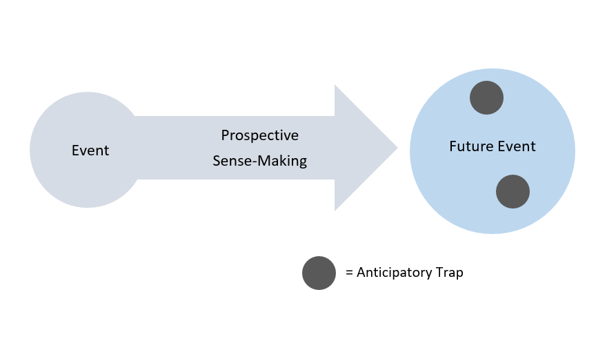
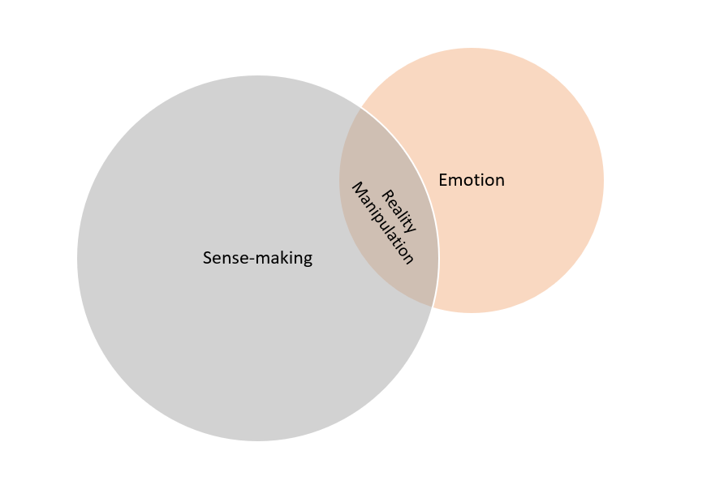
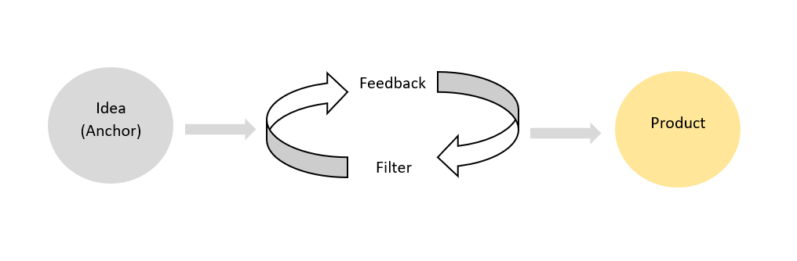

> Written as an essay for the course INF 2176 - Information Management in Organizations: Models and Platforms at University of Toronto

Pixar Animation Studios is considered a successful organization, recognized for trailblazing the 3-D animation in a competitive film industry. Pixar has the organizational reputation for producing creative, story-driven films that does extremely well in the box office. This paper examines the sense-making processes that went into Pixar’s early years, from its first films Toy Story to Toy Story 2, and introduces two processes that elaborates on prospective sense-making and emotional sense-making. This paper will also explore how Pixar fostered a community of practice which helped to establish their identity as a successful organization. This paper will argue that a community of practice within an organization equips its members with rich sense-making practices that results in high outputs of creativity. The findings from the organizational knowledge at Pixar will be combined with research in prospective and emotional sense-making, to suggest possible theories of practice that can be implemented to increase creative productivity in organizations.  

**_Key words_**: Sense-making, Pixar, community of practice, creativity, prospective sense-making, emotional sense-making, organization, anticipatory traps, reality manipulation, feedback-filtering

Sensemaking is a process of elimination. When an event occurs, the human mind tries to make sense of the situation and combats the newly generated information by eliminating what is uncertain (Choo, 2006, 105). Through this definition, it can be easily speculated that organizations utilize sense-making on a regular basis, whenever they are faced with an issue. Issues generate new information, which organizations must first harness and properly evaluate, in order to respond to it in a way that will yield the greatest profits for the organization. If an organization is able to train its employees to frame issues that arise and properly define possible responses, the organization is successfully sense-making.

For Pixar, challenges arise with each film. The organization has repeatedly produced stories and virtual environments never achieved in 3D animation before, such as the underwater environments in Finding Nemo, outer-space in WALL-E, as well as producing the first computer-animated feature film using plastic toy characters in Toy Story (Catmull, 2008, 64). With each new film, the technology and creative team at Pixar must use sense-making to figure out how to create a new virtual reality with characters that will make the story engaging and entertaining. 

Orton describes enactment, the first process of sense-making, as “translating pieces of the environment” to make sense of the context surrounding the issue (Orton, 2000, 231). An example of this can be found in the animators’ response to creating a new virtual reality in Toy Story. The movie Toy Story begins with green toy army men moving around in Andy’s room. In order to imitate the look and nature of movements of a plastic toy, the animators nailed a pair of sneakers to a wooden board to practice walking in them (Price, 2008, 135). In order to make sense of the physics involved in a plastic toy’s movements, the animators at Pixar constructed an imitation of the imagined reality by experimenting movement restrictions in the real world. Sense-making relies on what is plausible rather than what is accurate (Weick, Sutcliffe & Obstfeld, 2005, 419). By imitating the plastic toys’ movements in the real world, the animators were able to form a virtual reality that represented a world where toys could come alive, creating a reality never before explored. 

Kennedy & Dysart (2007) argue that there is a distinction between modernist sense-making and post-modernist sense-making. Interestingly, they argue that while modernists’ sense-making is grounded in normative methods to control and manage data, post-modernists’ sense-making is grounded in “storytelling” and “intense facilitation” of cognitive science (Kennedy & Dysart 2007, 8). It is apparent that at Pixar, intense manipulation of what was technologically possible in animation was explored by the creative team. Resources are often underexploited in organizations. However, at Pixar, the animators used intense sense-making to tackle on the challenge of introducing 3D animation to a competitive media industry. 

A process of sense-making involves adjusting one’s behaviour to the perceived changes in the environment (Choo & Bontis, 2002, 87). At Pixar, an example of behaviour adjustment for the environment is illustrated in the creation of Woody’s character. Woody is the main character of Toy Story, a cowboy toy who deals with insecurities as a leader when a new toy, Buzz Lightyear, enters Andy’s room. During the initial phase of drafting Woody’s character, the executives shut down the production of Toy Story after seeing a reel that portrayed Woody as an unlikable character (Price, 2008, 130). At the onset of such a disheartening news, the writers and the team had to work together in order to make Woody a character likeable. As Choo & Bontis (2002, 85) mentions, “shared meanings and purpose” drives the organization to recognize and tackle on the issue at hand together. To make Woody likeable, the writer and animators went back and forth to create new scripts that highlighted Woody’s desirable traits (Price, 2008, 131). They stripped the previous scenes that were not working, and placed sequences where Andy was shown playing with Woody at the beginning of the film, to highlight Woody’s importance for the plot (Price, 2008, 131). By introducing Woody’s desirable traits before presenting his undesirable traits, viewers could potentially find Woody more likable.

What the team at Pixar did to combat the issue of Woody’s character was sense-making. By framing the issue and selecting the components of Woody’s characteristic that made him undesirable, they were able to readjust Woody’s character. Readjusting to problems at hand and responding to fill in the gaps is part of sense-making. Weick, Sutcliffe & Obstfeld (2005, 410) states: “A central theme in both organizing and sensemaking is that people organize to make sense of equivocal inputs and enact this sense back into the world to make that world more orderly.” Only selecting the scenes that highlighted Woody’s positive attributes allowed the audience to accept and establish Woody as a main character, before his faults were introduced later in the film.  

After the success of the first Toy Story film, the animators and executives had a different issue for the second film: while all the animators who worked on Toy Story were working on Bug’s Story, the Toy Story 2 was being developed by a team who did not take part on the first film (Catmull, 2008, 67). As both films were being made simultaneously, the new team was ill-equipped to handle the storyline and production of Toy Story 2, and discovered that the story was not working (Catmull, 2008, 67). Toy Story 2 is about Woody getting kidnapped by a toy collector where he must make a decision to go back to Andy, his human friend who owns him.  The plot was too predictable, and as a response, the team at Pixar went into sense-making mode. They first recognized that the story was falling flat. They added an emotional element to Woody’s journey in the film, by creating “Jessie’s Story”, a 3-minute monologue that tells the story of a girl cowboy doll that gets discarded by her owner when the owner grows up (Catmull, 2008, 67). The realistic portray of the very likelihood that Woody might one day be abandoned by Andy makes his decision to go back to him more complex, producing an engaging story arc. This was Pixar prospective sense-making, where the creative team who saw the initial reel of Toy Story 2 realized that the audience that they gained from the first film will not respond well to a predictable story.

Prospective sense-making is described to be “Sensemaking processes where the attention and concern of people is primarily directed at events that may occur in the future” (Rosness et al, 2016, 55). Prospective sense-making, unlike retrospective sense-making, anticipates events in the future by conceptualizing it (Gioia, Mehra, 1996, 1229). When “Jessie’s Story” was added on to Toy Story 2, Pixar was prospective sense-making, and looked at the potential of the film’s ability to engage with more audiences. Ed Catmull, the current CEO of Pixar have stated that overcoming this issue and the subsequent success of Toy Story 2 was the “The defining moment for Pixar” (Catmull, 2008, 67). It proved that in creative environments, collaboration and feedback yields proper responses to issues, even issues not yet fully materialized. For Pixar, it was these sense-making practices that allowed the organization to be defined as a successful 3D animation studio.

The model of prospective sense-making may be improved by anticipating a possible issue in the future, here called an Anticipatory Trap. Anticipatory Traps describes possible gaps in the future that may act against the sense-maker’s effort to properly respond to an event. At Pixar, for example, the animators used prospective sense-making to predict what the audience will dislike about the plot of Toy Story 2. The Anticipatory Trap in this case is the predictable plot, which represents a possible negative outcome.

####Anticipatory Traps in Prospective Sense-Making

Anticipatory Traps in Prospective Sense-Making

 
This model of Anticipatory Traps in prospective sense-making allows sense-makers to recognize potential errors, even before the future event is fully materialized. This elaboration on prospective sense-making shows that unlike retrospective sense-making that simplifies an event, prospective sense-making may complicate the event by including possible future scenarios. Rosness et al. argue that retrospective and prospective sense-making is complimentary to one another, creating an ideal sense-making practice (Rosness et al, 2016, 55). Here, Colville, Brown & Pye’s (2011) term “Simplicity” works well to describe the phenomenon between retrospective and prospective sense-making. “Simplicity” states that making sense of events organizes while also explicates the event (Colville, Brown & Pye, 2011, 12). Anticipatory Traps are a more detailed method to examine prospective sense-making, where the benefits of sense-making with a sensitivity to the future could prove to be beneficial for an organization.

Sense-making is a direct answer to life’s ambiguity, and therefore it is a very useful tool to navigate through life’s events (Weick, Sutcliffe & Obstfeld, 2005, 409). Maitlis et al. (2013, 225) have stated that emotions can actually halt sense-making. In a fascinating study of emotional sense-making and its impact on healthcare practitioners, researchers found that the emotional reaction to an event affects an individual’s thinking and judgement capabilities (Bartunek et al., 2006, 189). Emotional sense-making can also be problematic for producing illogical responses, due to it often being unconscious for the individual (Bartunek et al, 2006, 202). For organizations like Pixar and other animation studios, their creative staff are often under tight deadlines, which could produce anxiety and stress. 

If emotions can affect sense-making, then it can also alter the person’s ability to properly respond to an event. Emotions like fear and anxiety can affect individuals, through a process of Reality Manipulation. 

####Reality Manipulation in Sense-Making 

Reality Manipulation in Sense-Making

Sense-making under intense emotions have the potential to alter an individual’s ability to perceive their surroundings and the environment sensibly, by eliminating necessary information needed to properly evaluate the situation. The emotional impact on sense-making is a research area that needs further exploration and elaboration, as mentioned by Weick, Sutcliffe & Obstfeld (2005, 419). The Reality Manipulation proposed in this paper describes the possible side-effects of emotions to affect sense-making, by reframing the very environment. Emotions have the capability to alter one’s reality where often sensibility and logic is affected. For organizations with members who are under high stress, the demanding nature the work involved could potentially affect the organization’s sense-making abilities. 

Pixar has unique organizational structure and culture that promotes flow of creativity. At Pixar, there is a weekly brainstorming session called the “Creative Brain Trust”, where the animator get verbal feedback from eight to ten directors in a room for two hours for their idea on the next film (Catmull, 2008, 67). What is unique about this feedback session is that it was designed to eliminate egos, negotiate respect and trust, and share casual knowledge. Advices are not mandatory to be given or taken (Catmull, 2008, 67). The animator is not forced to take the advice, which stimulates the liberty to ask for advice; while the directors give their genuine and honest feedback purely for the sake of improving the idea on the table. This results in the idea being improved through a process of filtration. In a model that I call Feedback-Filtering, advices are eliminated if it does not improve the idea so that only the advices that furthers the idea’s potential into a product continue on to the next feedback session. The original creative idea works as an anchor to represent the common goal of the members of the organization.

####The Process of Feedback-Filtering

The Process of Feedback-Filtering

Through the Feedback-Filtering process, members of the organization are free to have ideas, share ideas, and get feedback on their ideas. Ideas no longer become property, and is free to flow from one member to the other. The feeling of safety is key to facilitating this process, where only the selected feedbacks that improve the idea are implemented to create the final product. The “Creative Brain Trust” session is an opportunity to ask “What is going on here?”, “Why is the story not working?” and “How can we improve the story while maintaining it’s story structure?” At Pixar, the “Creative Brain Trust” session was born out of the lessons learned through the struggle and success of Toy Story 2 (Catmull 2008, 65). It taught their executives an important lesson about sharing creativity and feedback in order to make great movies. The decision-makers at Pixar believe ideas alone do not make great movies, but that the people who take that idea and improve on it make the great films (Paik et al., 2007, 159). 

What separates Pixar from other organizations is their approach to creating an environment in which everyone feels safe to speak their minds. Pixar believes that creativity is born out of people from different backgrounds who work well together (Catmull, 2008, 65). At Pixar, there are many initiatives in place for new hires to feel free to share ideas, seek advice, and solicit collaboration. One such initiative is that newly hired animators are tested on their ability to work well together during an “incubation stage”, where executives assess which teams work great together (Catmull, 2008, 66). Such internal structures of the organization allow members of the organization to form their own communities that helps foster creativity and knowledge. Another example of how Pixar facilitates their organizational culture is the Pixar University, where workshops and many brainstorming sessions allow the members to interact with other members of the organization outside the studio (Paik et al., 2007, 162). Communities of practices cannot be created on their own. Pixar’s organizational culture allows such communities to be shaped on their own organically, which allows ideas to freely flow between members.

An article from 2008 Harvard Business Review article stated, “Pixar is a community in the true sense of the word” (Catmull, 2008, 64). Perhaps most importantly, the reason why a community of practice was able to exist at Pixar was due to their emphasis on “a sense of safety to share ideas” (Paik et al., 2007, 162). This sense of safety and comradery among members promotes sharing of ideas, as well as the ability to sense-make with the least negative impacts. The success of an organization is described to be dependent on the organizational culture and set or practices laid out in the structure of organization (Choo & Bontis 2002, 88). Pixar have been an early example of an organization that saw the true potential for a community of practice. The success of the company and the emphasis they put on facilitating a community of practice is not a coincidence, but rather a direct output of the business practices in place. Pixar’s organization structure that encourages creativity through collaboration may be the recipe for success for creative organizations.

Regarding the creative process at Pixar, the CEO, Ed Catmull, stated “Creativity must be present at every level of every artistic and technical part of the organization. The leaders sort through a mass of ideas to find the ones that fit into a coherent whole – that support the story – which is a very difficult task. It’s like an archaeological dig where you don’t know what you’re looking for or whether you will even find anything. The process is downright scary” (Ed Catmull, 2008, 65). This statement by the head decision-maker at Pixar proves three things. Firstly, it proves that Pixar is constantly sense-making in order to find the coherent whole story that will resonate with its audiences. Secondly, there is many uncertainties involved in the process of their business process, which propels prospective sense-making to take place. Thirdly, there is fear and emotion involved in making of a film, and controlling emotional sense-making plays a huge part in the organization’s ability of come up with creative ideas. 

The reason for Pixar’s success as an organization relies on their communities of practice. The creative team who have proven that they work well together on the Toy Story franchise relied on their community of practice to sense-make when they faced issues, uncertainties in the future, or emotional hindrances. This paper argued the benefits of expecting Anticipatory Traps when prospective sense-making, and the importance of emotional sense-making with the Reality Manipulation model that warns sense-makers’ ability to properly evaluate their surrounding at times of emotional distress. This paper elaborated how a community of practice can foster creativity through the Feedback-Filtering model. These information gathering and processing practices have allowed Pixar to become an organization with powerful sense-making capabilities. In a competitive industry, a community of practice that recognizes prospective and emotional sense-making practices have the organizational potential to nurture explosive creativity. 

[^1]:
  Bartunek, J. M., Rousseau, D. M., Rudolph, J. W., DePalma, J. A. (2006). “On the Receiving End: Sensemaking, Emotion, and Assessments of an Organizational Change Initiated by Others.” The Journal of Applied Behavioral Science. 42:2, 182-206.
[^2]:
  Catmull, E. (2008). “How Pixar Fosters Collective Creativity.” Harvard Business Review 86:9, 64-72.

[^3]:
  Choo, C.W. (2002). Information Management for the Intelligent Organization: The Art of Scanning the Environment. 3rd ed. Medford, NJ: Information Today, Inc.

[^4]:
  Choo, C.W., & Bontis, N. (2002). The Strategic Management of Intellectual Capital and Organizational Knowledge. New York: Oxford University Press.

[^5]:
  Colville, I., Brown A.D., Pye, A. (2011). “Simplexity: Sensemaking, organizing and storytelling for our time.” Human Relations 65:1, 5-15.

[^6]:
  Gioia, D.A. & Mehra, A. (1996) "Sensemaking in Organizations: book review." Academy of Management Review 21:4, 1226-1229.

[^7]:
  Kennedy, M.L., & Dysart, J. (2007). Intranets for Info Pros. Medford, NJ: Information Today Inc.

[^8]:
  Maitlis, S., Vogus, T.J., Lawrence, T.M. (2013) “Sensemaking and Emotion in Organizations.” The Organizational Psychology Review. 3:3, 222-247. 

[^9]:
  Orton, J. D. 2000. “Enactment, Sensemaking, and Decision Making: Redesign Processes in the 1976 Reorganization of US Intelligence.” Journal of Management Studies. 37, 213–234.

[^10]:
  Paik, K., Iwerks, L., Lasseter, J., Jobs, S., & Catmull, E. (2007). To Infinity and Beyond!: The Story of Pixar Animation Studios. San Francisco: Chronicle Books.

[^11]:
  Price, D.A. (2008). The Pixar Touch: The making of a company. New York: Knopf Doubleday Publishing Group.

[^12]:
  Rosness, R., Evjemo, E., Haavik, T., Waero, I. (2016) “Prospective Sensemaking In The Operating Theatre.” Cogn Tech Work 18, 53-69.

[^13]:
  Weick, K.E., Sutcliffe, K.M., Obstfeld, D. (2005) “Organizing and the Process of Sensemaking.” Organization Science 16:4, 409-421.
