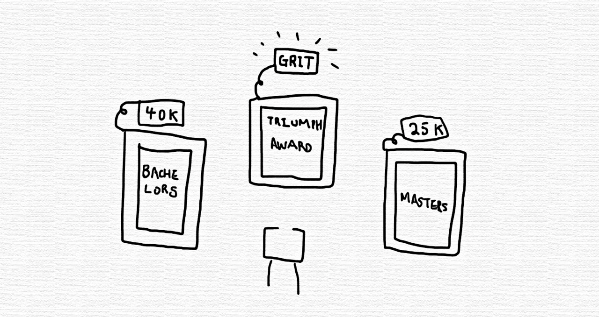

> “Nobody wants to show you the hours and hours of becoming. They'd rather show the highlight of what they've become.” ― Angela Duckworth

 

To some, higher education is a granted option. A privilege offered as a natural step towards success. This was not my story.

Triumph Award

##My Journey to Higher Education

In high school me and my sisters were orphaned children and refugee-immigrants, living from check to check. At the time, me and my sisters were barely scraping by with the little money we received from social services. My sister worked four jobs in high school, and we lived in constant fear of the Canadian immigrant officers deporting us back to our country of birth. Uneducated and with no one to protect us, we were alone to deal on our own, scared and fearful to trust anyone to disclose our struggles.

In grade 10, I transferred in the middle of the semester to a predominantly white school. I missed my life at Jane and Weston[^1], and it was frankly my first time being surrounded by white people. One day at school, someone broke into my locker and stole my wallet. I didn't know what to do. I was too scared to even report it. I knew no one could help me. On fourth period Chemistry, in the middle of class, I stood up and walked out. Without my metropass, it took me two hours in the freezing winter to walk home that afternoon. 

The next day at school, I was in front of my guidance counsellor. Mr. Soloman[^2] wanted to speak to me, ask me why I had skipped school the day before. When he asked, I just began sobbing. The room filled with adults, one by one. It was humiliating, because it was my first time ever crying in front of a stranger, and it was the first time ever in which I called out to someone for help. I realize now though, that it was also necessary. I never sought help from anyone before. My guidance counsellors enrolled me in the free bus ticket program. They made sure I didn't go hungry during lunchtime anymore. They made me apply for the Triumph Award.

My Accomplishments on My Wall

##Grit on My Wall

My masters cost me 25K, my bachelors 40K, but somehow my Triumph Award feels like a bigger accomplishment to me now. Like the description of the scholarship states, I was able to graduate despite extraordinary circumstances and even ended up going to university, at a time when such an endeavor seemed impossible to achieve.
Of all the framed feats that hang on my wall today, my Triumph Award, a small scholarship in the grand scheme of things (that certainly came cheaper than my degrees) holds a special place in my heart. It represents the grit that it took to make it here.

##What Success is to Me

I don't measure success by an amount of money or accolades. The amount of privilege someone had or has over me, or whether or not someone is deemed "successful" by society. What does that even mean, anyways? People seem to applaud anyone rich or famous. I measure success by the perseverance that took to keep moving forward, even in the face of adversity. That’s what success is to me. If you are still here despite it all - that's success. I think it my little award from high school tells a better story of who I am than my resume ever could. 

##Not All Degrees are Created Equal

Not all degrees are created equal because the work that went into achieving a degree varies on the level of financial and emotional support a student had, and ultimately the privileges they had in achieving the degree. In the same class, it was a world of a difference - for some it was life or death, while for others it was mainly treated as a joke[^3].

I cannot relate to the dull-mindedness of employers who believe that filterings their applicants by academic institutions or level will grant them superior applicants. There are youth who work in fast food restaurants who have better organizational and leadership skills than some university-level coop students that companies limit their hiring to. We need to break out of our elitist mindset when we review applicants[^4], and begin to properly assess applicants based on their individual feats - not by standardized tests and education. In two applicantions with identical acheivements, the student who worked and managed to acheive the same without privilege is more desirable as an applicant, because to do so without means they are more resiliient, capable, and likely to succeed.

[^1]:
  Jane and Weston is a low-income neighborhood in Toronto with one of the lowest <a href="https://www.theglobeandmail.com/news/toronto/140-toronto-neighbourhoods-ranked-by-new-equity-score/article17407725/" title="neighbourhood equity index of Toronto" target="_blank" rel="noopener noreferrer">neighbourhood equity score</a>, with common gun and knife violence. Drake once rapped: “How did I finesse all this shit from Jane and Weston?”

[^2]:
  Mr. Solomon continued to play an important role in me graduating from high school. I remember that for about a month after the incident he would show up randomly on my first period. Looking back, I think that was his discreet way of making sure I made it to school okay and that I was alright.

[^3]:
  Overcoming adversity forces the person to change the way they view and approach a problem, that leads to increased adapatability and preparedness for future issues. 

[^4]:
  I jumped the gun here - in fact the real problem for companies is learning how to reach potential applicants to become applicants. There is a huge gap between a company with job opportunities, and potential youth living in underrepresented communities.

