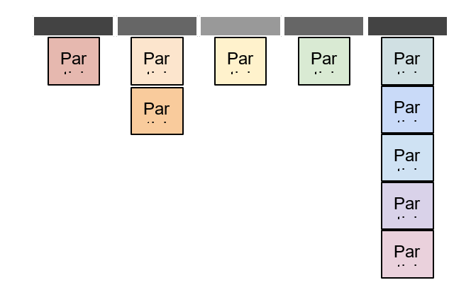
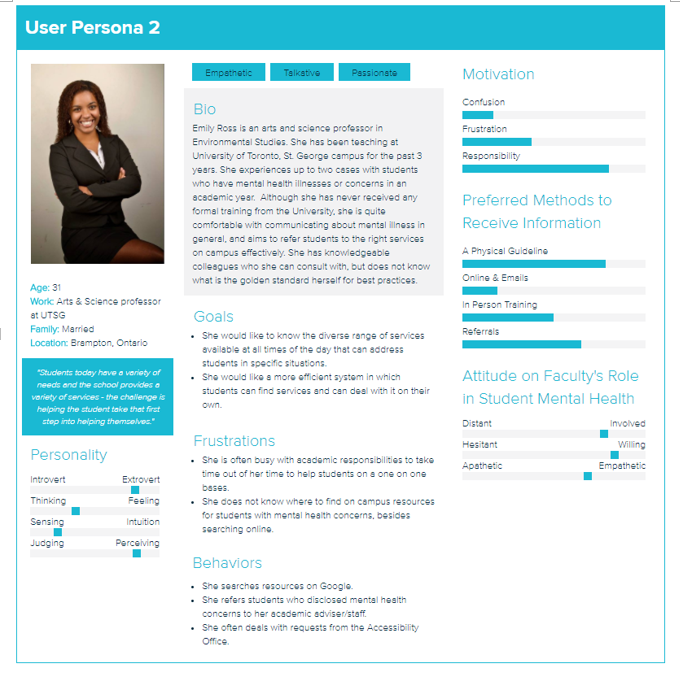
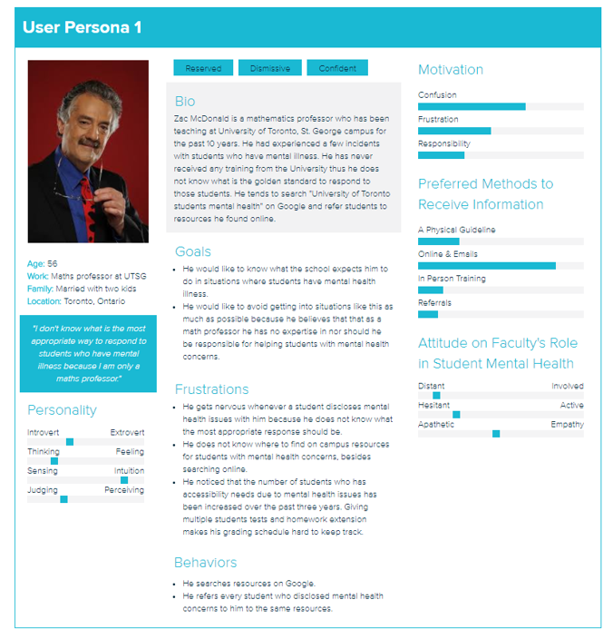

#Mental health issues are increasingly challenging for students in Canadian postsecondary institutions.  
University of Toronto's Student Life tasked us to discover the pain points experienced by students seeking out help on a campus setting. As part of a UX Research Expo 2018 at the Faculty of Information, we were tasked to investigate and discover the quantitaitve and qualitative data that could potentially support the creation of a new service for students.

3 Users: Faculty, Service Provider, Student

#Inform the design of a unified resource for faculty to appropriately respond to students with mental health concerns. 
Through 29 student survey participants, 10 in-depth interviews with faculty members from diverse range of departments, and healthcare service providers on campus we two major issues the research should tackle: 1. A lack of clarity in the faculty’s role for student mental health and 2. Difficulties in distinguishing appropriate mental health resource(s) for diverse needs of students.

Mixed-Methods User Research Approach

#Close the gap between the students seeking help and the service providers who can offer the help efficiently and in a timely manner.

Our research was situated in the User-Centered Design framework to both evaluate the current systems available to faculty, and also to inform the requirement analysis for a new system that could encompass all resources into a central space, thus unifying the resources that can easily help faculty locate the information they need regarding student mental health.

User Personas

We distilled our research into 8 Design Recommendations which we presented in front of a panel of judges at UofT's 2018 UX Research Expo.

Final Research Report
